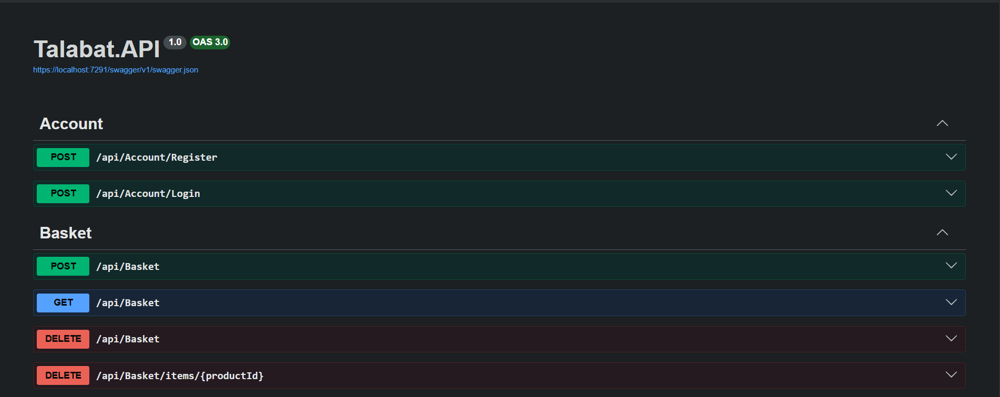
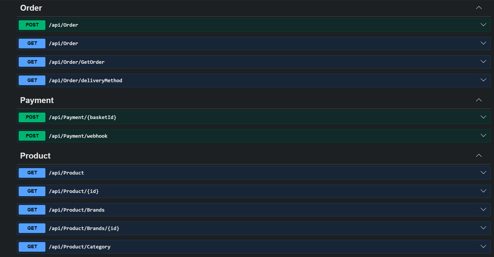

# E-Commerce Backend API

A production-grade E-Commerce Backend API built with ASP.NET Core following Onion Architecture and SOLID Principles. The project provides a scalable, maintainable, and secure backend solution for modern e-commerce applications.

## Features

### Authentication & Authorization

* ASP.NET Core Identity
* JWT Authentication
* Role-Based Authorization
* Secure User Registration and Login

### Product Management

* Create, Update, Delete, and Retrieve Products
* Product Categories and Brands
* Advanced Filtering, Sorting, and Pagination

### Shopping Basket

* Redis Distributed Caching
* Basket Management
* Optimized Performance with Reduced Database Load

### Orders & Payments

* Order Processing
* Stripe Payment Gateway Integration
* Secure Online Transactions

### Architecture & Design Patterns

* Onion Architecture
* SOLID Principles
* Repository Pattern
* Unit of Work Pattern
* Specification Pattern

### API Documentation

* Swagger / OpenAPI Integration

### Error Handling

* Global Exception Handling Middleware
* Consistent API Responses

### Performance Optimization

* AutoMapper for DTO Mapping
* Query Optimization
* Redis Caching

---

## Technologies Used

* ASP.NET Core Web API
* Entity Framework Core
* SQL Server
* ASP.NET Core Identity
* JWT Authentication
* Redis
* Stripe
* AutoMapper
* Swagger / OpenAPI

---


 ---

 📸 Screenshots




---

## Project Architecture

The project follows Onion Architecture:

```text
├── API
├── Core
│   ├── Entities
│   ├── Interfaces
│   └── Specifications
├── Infrastructure
│   ├── Data
│   ├── Repositories
│   └── Services
└── Shared
```

---

## Getting Started

### Prerequisites

* .NET 8 SDK
* SQL Server
* Redis Server
* Stripe Account

### Installation

1. Clone the repository

```bash
git clone https://github.com/yourusername/ecommerce-api.git
```

2. Navigate to the project

```bash
cd ecommerce-api
```

3. Configure appsettings.json

```json
{
  "ConnectionStrings": {
    "DefaultConnection": "Your SQL Server Connection String"
  },
  "JWT": {
    "Key": "Your Secret Key"
  },
  "Stripe": {
    "SecretKey": "Your Stripe Secret Key"
  }
}
```

4. Apply migrations

```bash
dotnet ef database update
```

5. Run the application

```bash
dotnet run
```

6. Open Swagger

```text
https://localhost:<port>/swagger
```

---

## Key Implementations

* JWT Authentication & Authorization
* Role-Based Access Control
* Stripe Payment Integration
* Redis Distributed Caching
* Repository & Unit of Work Patterns
* Specification Pattern
* Global Exception Handling
* AutoMapper
* Filtering, Sorting & Pagination
* Swagger Documentation

---

## Future Improvements

* Email Verification
* Refresh Tokens
* Background Jobs
* Product Reviews & Ratings
* Docker Support
* CI/CD Pipeline

---

